#  WebCrawler

Реализован краулер с использованием шаблона *producer-consumer*.
> Краулер — программа, предназначенная для обхода страниц Интернета с целью получения из них необходимой информации.

1. Программе на вход подаются следующие аргументы:
    * адрес HTML страницы `--url`;
    * глубина поиска по странице `--depth`;
    * количество потоков для скачивания страниц `--network_threads`;
    * количество потоков для обработки страниц `--parser_threads`;
    * путь до выходного файла `--output`.
1. Программа рекурсивно обходит все ссылки встречающиеся на странице. Начальная страница обхода передается аргументом командной строки `url`. Глубина обхода равна `depth`.
1. Программа записывает в выходной файл `output` все ссылки на изображения, которые встречаются при обходе страниц.
1. Количество `producer` задается аргументом командной строки `network_threads`, а количество `consumer` - аргументом `parser_threads`.
1. Для процессинга страниц используется [gumbo-parser](https://github.com/google/gumbo-parser).
1. Для скачивания HTML страниц используется [Boost::Beast](https://github.com/boostorg/beast).
1. Для обработки параметров командной строки используется компонент `boost::program_options`.
1. Для работы с потоками был использован пул потоков [ThreadPool](https://github.com/progschj/ThreadPool).

## Шаблон producer-consumer
При решении задачи был использован шаблон procuder-consumer два раза, по следующей схеме:

### How to use

1. apt install git g++ cmake
1. git clone https://github.com/qDerezzed/Crawler.git
1. cd Crawler
1. mkdir build && cd build
1. cmake .. && make

Пример запуска:

./WebCrawler --url https://habr.com/ru/post/566052/ --depth 1 --network_threads 2 --parser_threads 2 --output ./result.txt

